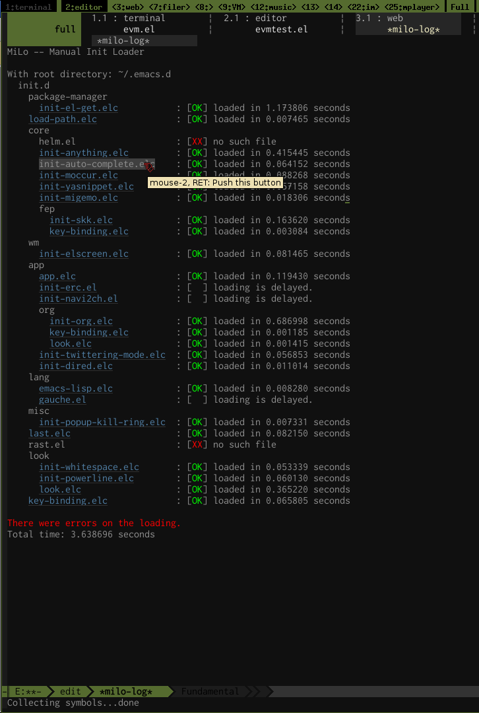

manual-init-loader
==================

This package, MiLo, is an init config file loader for Emacs, which is easily configurable and
controllable.

## Concept

- Easily configurable and controllable.  Some files are automatically loaded and the others needs
  manual loading.
- Recursive use of directories.
- Dividing configurations of applications, relation of applications, etc.
- Benchmark.

### What is the difference comparing with the other init loaders?

There are some init loaders for Emacs with different concept.  For example,
- `init-loader.el`
  Unix/Linux like init loader.  File system base.
  Loading order is decided by prefix numbers of file names.
- `el-init.el` (https://github.com/HKey/el-init)
  Directory and recursive loading are available but not easily controllable.
  Dependencies are controlled using `provide`/`require` hack.

### Emacs as environment

There are a lot of Emacs applications.  As one use those useful app his config file swells up.
We need to divide Emacs init file into file with appropriate size with logical structure.
MiLo supports:
- category of application;
- relationship of applications;
- switching of loading features from config file.

## Usage

We realize these features with explicit loading directory tree and auto loading some files for each
directory.  The following is a part of my config file:

	(add-to-list 'load-path "/path/to/manual-init-loader")
	(require 'manual-init-loader)

	(setq milo-file-name-prefix "init-")  ; Default.  Try to load /pathto/<file>.el or /pathto/init-<file>.el in this order.
	(setq milo-raise-error nil)           ; Default.  Prevent critical error in start up process.
	;; For each directory, load "pre-load.el" and "init.el" if exist, before loading designated files.
	;; Similarly "key-binding.el" and "look.el" after.
	;; For more flexible control, use `milo-preprocess-specs-function'.
	(setq milo-ex-ante-specs '(("pre-load.el"    (@ :only-when-exists t))
	                           ("init.el"        (@ :only-when-exists t)))
	      milo-ex-post-specs '(("key-binding.el" (@ :only-when-exists t))
	                           ("look.el"        (@ :only-when-exists t))))

	;; Load directory tree.
	(milo-load "~/.emacs.d"
	           '(init.d (package-manager "el-get.el")  ; ~/.emacs.d/init.d/package-manager/init-el-get.elc
	                    "load-path.el"                 ; ~/.emacs.d/init.d/load-path.elc
	                    (core "helm.el"                ; no such file "init-helm.el" or "helm.el"
	                          "anything.el"            ; ~/.emacs.d/init.d/core/init-anything.elc
	                          "auto-complete.el"
	                          "moccur.el"
	                          "yasnippet.el"
	                          "migemo.el"
	                          (fep "skk.el"))          ; ~/.emacs.d/init.d/core/fep/init-skk.elc
                                                       ; ~/.emacs.d/init.d/core/fep/key-binding.elc
	                    (wm "elscreen.el")
	                    (app "app.el"
	                         ("erc.el" (@ :load-after-load erc))          ; `eval-after-load'
	                         ("navi2ch.el" (@ :load-after-load navi2ch))  ; Similarly.
	                         (org "org.el")
	                         "twittering-mode.el"
	                         "dired.el")
	                    (lang "emacs-lisp.el"
	                          ("gauche.el" (@ :load-after-load gauche-mode)))
	                    (misc "popup-kill-ring.el")
	                    "last.el"
	                    "rast.el"
	                    (look ; "look.el"
	                          "whitespace.el"
	                          "powerline.el")
	                    ))

	;; Autoloads
	(milo-lazyload (navi2ch) "navi2ch")
	(milo-lazyload (gauche-mode) "gauche-mode")
	(setq auto-mode-alist
	      (cons '("\\.\\(scm\\)$" . gauche-mode) auto-mode-alist))

With this config, MiLo loaded files under `~/.emacs.d/init.d`.
After Emacs init process finishes, `*milo-log*' buffer shows the result.

